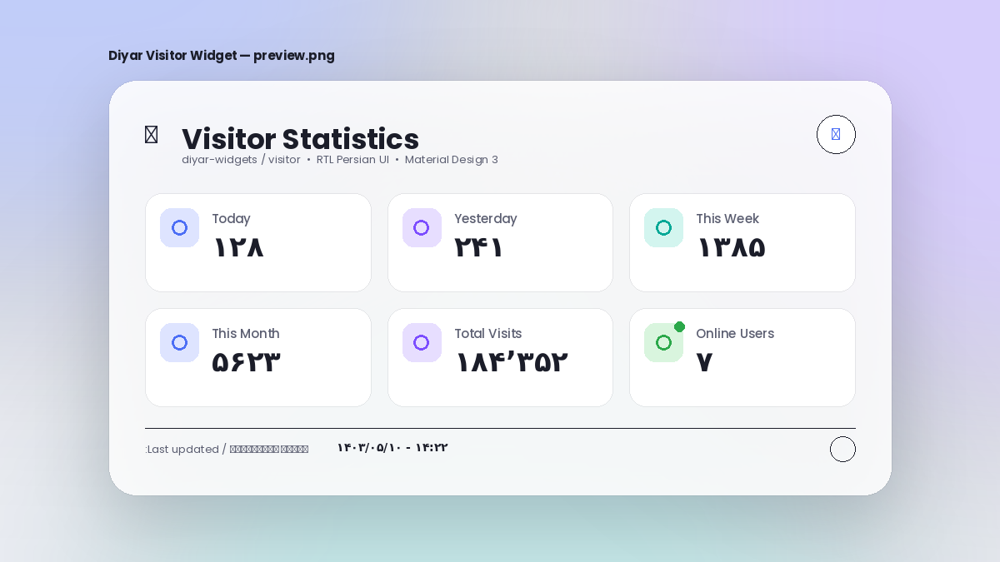

# 📊 Diyar Visitor Widget

**A modular, dependency-free Material Design 3 widget for beautifully displaying
visitor statistics — with first-class RTL Persian support, animated theming,
and zero framework overhead.**

Part of the [`diyar-widgets`](https://github.com/diyar-widgets/diyar-widgets)
collection. This package lives at `diyar-widgets/visitor`.



[](./LICENSE)
[](./CHANGELOG.md)
[](./package.json)
[](#-code-quality)

---

## ✨ Features

- **📊 Six live-feeling stat cards** — Today, Yesterday, This Week, This
  Month, Total Visits, and Online Users, each with its own icon and color
  role.
- **🎨 Material Design 3 visuals** — role-based color tokens, soft elevation
  shadows, glassmorphism surfaces, rounded corners at every scale, and
  professional, breathable spacing.
- **🌗 Light / Dark / Auto theming** — automatically detects and follows the
  browser's `prefers-color-scheme`, persists explicit user choices, and
  cross-fades smoothly between themes.
- **🕋 Native RTL & Persian typography** — right-to-left layout, the
  [Vazirmatn](https://github.com/rastikerdar/vazirmatn) typeface, and full
  Persian (Farsi) UI copy out of the box.
- **🔢 Persian digit formatting** — a reusable `toPersianDigits()` helper
  converts numbers like `184352` into `۱۸۴٬۳۵۲` with correct thousands
  separators.
- **🎬 Rich, tasteful motion** — animated counters (ease-out roll-up),
  staggered fade/slide/scale card entrances, Material ripple feedback,
  shimmering loading skeletons, and hover micro-interactions.
- **⚡ Zero dependencies, zero build step** — pure ES2023 vanilla
  JavaScript loaded as plain `<script>` tags. No React, no Vue, no
  Bootstrap, no Tailwind, no jQuery.
- **🧩 Clean, swappable data layer** — reads real data from `stats.json`
  with automatic retries and graceful fallback, architected so swapping in
  a live backend later is a one-function change (see
  [Data Layer & Future Backends](#-data-layer--future-backends)).
- **🔗 Single-tag embed** — `embed.js` turns the whole widget into one
  `<script>` tag for third-party pages, Blogfa included, with automatic
  duplicate-load protection and support for multiple widgets per page.
- **♿ Accessible by default** — semantic landmarks, ARIA roles/labels,
  full keyboard support, visible focus states, a polite live region for
  updates, `prefers-reduced-motion` support, and `forced-colors` compatibility.
- **📱 Fully responsive** — tuned breakpoints for mobile phones, folded and
  unfolded foldables, tablets, laptops, and large/ultra-wide monitors.

---

## 📦 Installation

### Option 1 — Single-tag embed (Blogfa, plain HTML, any third-party page)

The simplest way to add the widget to any page you don't control the
`<head>` of — including Blogfa templates:

```html
<script src="https://maghool51.github.io/diyar-widgets/visitor/embed.js"></script>
```

Drop that one tag anywhere in your page's body and a widget instance
renders exactly there. `embed.js` automatically:

- creates its own mount container at that exact position in the page,
- loads `visitor.css` and the icon sprite once, no matter how many times
  the tag appears on the page,
- loads `config.js` → `utils.js` → `theme.js` → `animations.js` →
  `visitor.js` in the correct order,
- resolves `stats.json` to an absolute URL so it works correctly even
  though the page is hosted somewhere else entirely,
- supports multiple widgets on one page — just repeat the tag wherever
  you want another instance.

### Option 2 — Copy the folder (full control over markup)

Copy the `visitor/` directory into your project and reference the files
directly:

```html
<link rel="stylesheet" href="visitor/visitor.css" />

<div id="diyar-visitor-widget"></div>

<script src="visitor/config.js"></script>
<script src="visitor/utils.js"></script>
<script src="visitor/theme.js"></script>
<script src="visitor/animations.js"></script>
<script src="visitor/visitor.js"></script>
```

### Option 3 — Clone the monorepo

```bash
git clone https://github.com/diyar-widgets/diyar-widgets.git
cd diyar-widgets/visitor
npm run serve
```

`npm run serve` starts a static file server (via `serve`) at
`http://localhost:5050` — no build step, no bundling, no compilation.

### Option 4 — npm package

```bash
npm install @diyar-widgets/visitor
```

---

## 🚀 Usage

The widget auto-mounts on `DOMContentLoaded` into every element matching
any of three conventions, so more than one widget can coexist on a single
page:

```html
<!-- Legacy single-widget convention (still fully supported) -->
<div id="diyar-visitor-widget"></div>

<!-- Attribute convention — preferred for multiple widgets -->
<div data-diyar-widget></div>
<div data-diyar-widget></div>

<!-- Class convention — equivalent to the attribute convention -->
<div class="diyar-visitor-widget"></div>
```

The default id-based selector is configurable via `config.js` →
`MOUNT_SELECTOR`; the attribute and class conventions are always active
alongside it.

### Programmatic control

Every mounted instance is also reachable through the public `DiyarVisitor`
API for cases where you need manual control (e.g. a single-page app that
mounts the widget after a route change):

```js
// Mount manually into any element, selector, NodeList, or array of elements
const instance = DiyarVisitor.mount('#my-custom-container');

// Mounting more than one element at once returns an array of instances
const instances = DiyarVisitor.mount(document.querySelectorAll('.my-widgets'));

// Force an immediate data refresh
await instance.refresh();

// Switch the theme programmatically
instance.setTheme('dark'); // 'light' | 'dark' | 'auto'

// Tear down timers, listeners, and rendered markup entirely
instance.destroy();
```

Auto-mounted instances are also exposed as `window.DiyarVisitorInstances`
(an array, one entry per matched element on the page). Calling `mount()`
again on an element that already has a live instance returns that same
instance rather than creating a duplicate.

---

## 🎛️ Customization

All tunables live in **one file — `config.js`** — so the rest of the
codebase never needs to be touched for everyday customization:

| Key                | Purpose                                                        |
| ------------------ | ---------------------------------------------------------------- |
| `VERSION`          | Semantic version, surfaced in the footer & console banner.       |
| `CACHE_TIME`       | How long (ms) fetched data is considered fresh.                  |
| `UPDATE_INTERVAL`  | Background polling interval (ms).                                |
| `DEBUG`            | Enables verbose, namespaced console logging.                     |
| `ANIMATION_SPEED`  | Object of durations for counters, entrances, theme fades, ripples, and skeleton shimmer. |
| `THEME`            | Default mode (`'light' \| 'dark' \| 'auto'`) and storage key.    |
| `DATA_URL`         | Location of `stats.json` — the single place that hardcodes it.  |
| `API_TIMEOUT`      | Timeout (ms) before a `stats.json` request is aborted.           |
| `API_RETRY_COUNT`  | Additional retry attempts after a failed request, before falling back. |
| `API_ENDPOINT`     | Reserved for a future live backend endpoint (not yet consumed).  |
| `DEFAULT_DATA`     | The fallback statistics object rendered if `stats.json` is unreachable. |
| `LOCALE` / `TIMEZONE` | Used for Persian digit + date/time formatting.                 |
| `MOUNT_SELECTOR`   | Additional CSS selector the widget auto-mounts into (alongside the always-active `[data-diyar-widget]`/`.diyar-visitor-widget` conventions). |

### Re-theming

Every color, radius, blur, and font in `visitor.css` is a CSS custom
property declared under `.diyar-visitor` (light) and
`.diyar-visitor[data-diyar-theme='dark']` (dark) — deliberately **not**
`:root`, so the widget's styling can never leak onto the page it's
embedded in (see [`embed.js`](#-installation) above). Override any subset
by targeting the same mount element in your own stylesheet, loaded after
`visitor.css`:

```css
#diyar-visitor-widget {
  --diyar-primary: #ff6b6b;
  --diyar-radius-lg: 16px;
}
```

### Changing labels or adding a stat card

Card definitions live in a single declarative array (`STAT_DEFINITIONS`)
inside `visitor.js`. Add, remove, or relabel a card by editing one array
entry — the markup, entrance animation, and counter wiring all key off it
automatically:

```js
{ key: 'today', label: 'امروز', icon: 'icon-eye', tone: 'primary' }
```

---

## 🗂️ Folder Structure

```
visitor/
├── index.html          # Demo page + SVG icon sprite + script loading order
├── visitor.css          # Widget styles — fully scoped under .diyar-visitor
├── demo.css              # Page-shell styles for index.html only (never embedded)
├── visitor.js             # Core controller — mounts, renders, wires events
├── embed.js                # Single-tag loader for third-party pages (Blogfa etc.)
├── config.js                # Single source of truth for every tunable value
├── utils.js                   # Formatters, easing, and the isolated data layer
├── theme.js                    # Light/Dark/Auto theme engine + persistence
├── animations.js                 # Counter, entrance, ripple & skeleton engine
├── stats.json                     # The widget's actual data source
├── README.md
├── CHANGELOG.md
├── LICENSE
├── package.json
├── .gitignore
├── preview.png              # Repository preview image
├── icons/                   # Standalone copies of every sprite icon
│   ├── favicon.svg
│   ├── eye.svg
│   ├── calendar.svg
│   ├── globe.svg
│   ├── online.svg
│   └── chart.svg
└── assets/                  # Reserved for future static assets
```

**Module responsibilities at a glance:**

- `config.js` — every constant; nothing elsewhere hard-codes a number.
- `utils.js` — pure formatting helpers **and** the data layer
  (`fetchVisitorStats`), the only place that knows where numbers come from.
- `theme.js` — resolves `light`/`dark`/`auto`, persists the choice, and
  reacts live to OS-level theme changes.
- `animations.js` — a tiny animation toolkit (counters, staggered
  entrances, ripples, skeleton toggling) with no DOM-building of its own.
- `visitor.js` — the only module that builds/mutates the widget's DOM; it
  composes the three subsystems above into a mountable instance.
- `embed.js` — a standalone loader; not part of the module chain above,
  it exists purely to fetch and wire up the other five scripts on a page
  that only wants to add one `<script>` tag.
- `visitor.css` / `demo.css` — kept as two separate files on purpose: the
  former is safe to load on any third-party page, the latter is not.

---

## 🔌 Data Layer & Future Backends

The widget's real data source today is **`stats.json`**, fetched by
`utils.js`'s `fetchVisitorStats()` from the URL in `config.DATA_URL`
(defaults to `./stats.json`, resolved automatically to an absolute URL
when loaded via `embed.js` on a third-party page). It supports either a
flat or a versioned/nested schema (both are auto-detected — see the
schema documentation at the top of `utils.js`),
retries automatically on failure (`config.API_RETRY_COUNT`), and falls
back to the last successfully cached snapshot — or to `DEFAULT_DATA` if
nothing has ever loaded — if every attempt fails. See
[Customization](#-customization) for the full list of related config keys.

Because `visitor.js` only ever calls `fetchVisitorStats()` and never
inspects where the data came from, swapping the static file for a live
backend (a REST API, a Cloudflare Worker, Supabase, Firebase, or a
GitHub Action that regenerates `stats.json` on a schedule) requires
editing **only `requestStatsJsonOnce` inside `utils.js`** — no changes to
rendering, animation, theming, or `visitor.js` itself.

**Planned for future releases:**

- [ ] Optional WebSocket transport for real-time "online users" updates.
- [ ] Pluggable data adapters (REST, GraphQL, Firebase) selectable via config.
- [ ] Historical trend sparkline per card.
- [ ] Multi-language copy (English / Arabic) alongside the Persian default.
- [ ] A CLI scaffolding tool for generating new `diyar-widgets` packages.

---

## 🌐 Browser Support

| Browser              | Supported |
| --------------------- | :-------: |
| Chrome / Edge (latest 2) | ✅ |
| Firefox (latest 2)       | ✅ |
| Safari (latest 2)        | ✅ |
| Opera (latest 2)         | ✅ |
| iOS Safari / Chrome Android | ✅ |
| Internet Explorer 11     | ❌ |

The widget relies on standard, well-supported modern web platform features:
CSS custom properties, `backdrop-filter`, `Intl.DateTimeFormat`,
`matchMedia`, and `requestAnimationFrame`. No polyfills are bundled.

---

## ♿ Accessibility

- Landmark region (`role="region"`) with a descriptive `aria-label`.
- Every stat card is a semantic list item (`role="listitem"`) inside an
  `role="list"` container.
- Loading state is announced via `aria-busy`, and a polite `aria-live`
  region announces successful/failed refreshes.
- Theme toggle and refresh controls are real `<button>` elements with
  descriptive `aria-label`s, full keyboard operability, and visible
  `:focus-visible` outlines.
- Respects `prefers-reduced-motion` (animations resolve instantly rather
  than being skipped, so no information is lost) and `forced-colors` (high
  contrast mode).

---

## 🖼️ Screenshots

| Light Mode | Dark Mode |
| :---: | :---: |
|  | *Toggle the theme button in the widget header to preview Dark and Auto modes live.* |

> The widget's real UI renders entirely in Persian with right-to-left
> layout; `preview.png` above is a static repository preview image.

---

## 🛠️ Code Quality

- **Strict mode & ES2023** across every script.
- **Modular architecture** — five single-responsibility modules
  (`config`, `utils`, `theme`, `animations`, `visitor`) composed by one
  controller, plus a sixth, standalone loader (`embed.js`) for single-tag
  third-party embedding, with no circular dependencies.
- **Zero framework, zero build step** — works by dropping `<script>` tags
  into any HTML page, static site generator, CMS, or server-rendered app.
- **Professional inline documentation** — every exported function carries
  a JSDoc block describing its contract.
- **No TODOs, no placeholders, no dead code.**

---

## 🤝 Contribution Guide

Contributions are welcome! To propose a change:

1. Fork the repository and create a feature branch:
   `git checkout -b feature/my-improvement`
2. Keep the zero-dependency, zero-build philosophy intact — new code
   should still run as plain `<script>` tags.
3. Match the existing code style: strict mode, JSDoc on every exported
   function, and CSS custom properties for anything themeable.
4. Run `npm run format` before committing.
5. Open a pull request against `diyar-widgets/diyar-widgets` describing
   the motivation and behavior of your change.
6. Update `CHANGELOG.md` under an `[Unreleased]` heading.

Bug reports and feature requests are welcome via GitHub Issues.

---

## 📄 License

Released under the [MIT License](./LICENSE) © 2026 Diyar Widgets
Contributors.
